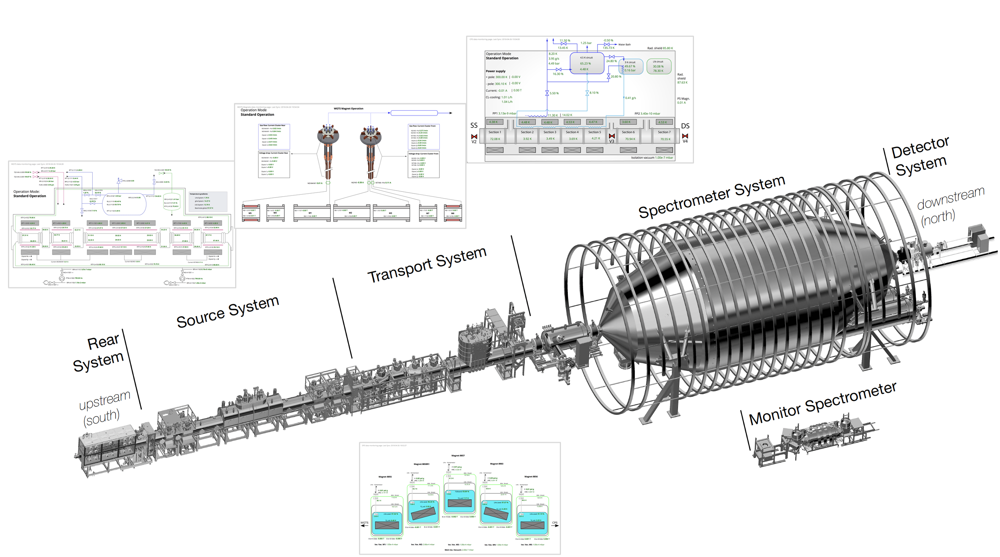

# BORA: Personalized Data Display for Large-scale Experiments

    

BORA is an open source visualization framework designed for large-scale experiments. It generates personalized data displays and supports human-in-the-loop workflows. BORA enables scientists to configure data displays without programming. The framework provides two main functions: read-only displays for monitoring experiment subsystems, and interactive controls for system and data acquisition parameters. It supports feedback for multiple data processing pipelines operating on large data volumes in real time. BORA uses RESTful APIs and supports standard protocols through plugins, including database integration (e.g., Redis) and control protocols (e.g., OPC). Experiment-specific protocols, such as ORCA, are also implemented.

## Bora 3

Bora 3 extends the architecture of Bora 2, maintaining personalized data display logic and dashboard composition from reusable widgets. It introduces support for multiple independent schematics, allowing users to define and switch between experiments, displays, and monitors within a unified framework. The system uses a modern web stack and a typed widget model for flexible dashboard management.

## Goals

- Provide a user interface with simplified configuration and extensibility
- Support management of multiple dashboards through flexible schematics
- Use a strongly-typed web stack for reliability and maintainability
- Offer clear architectural documentation

### Architecture

- Next.js App Router (React + TypeScript) for UI and server actions
- Prisma ORM with SQLite by default (configurable via `DATABASE_URL`)
- File-based dashboard schematics stored under `public/uploads`
- Strongly-typed widget model and dynamic rendering via a widget map
- Tailwind CSS and shadcn/ui for accessible, consistent components
